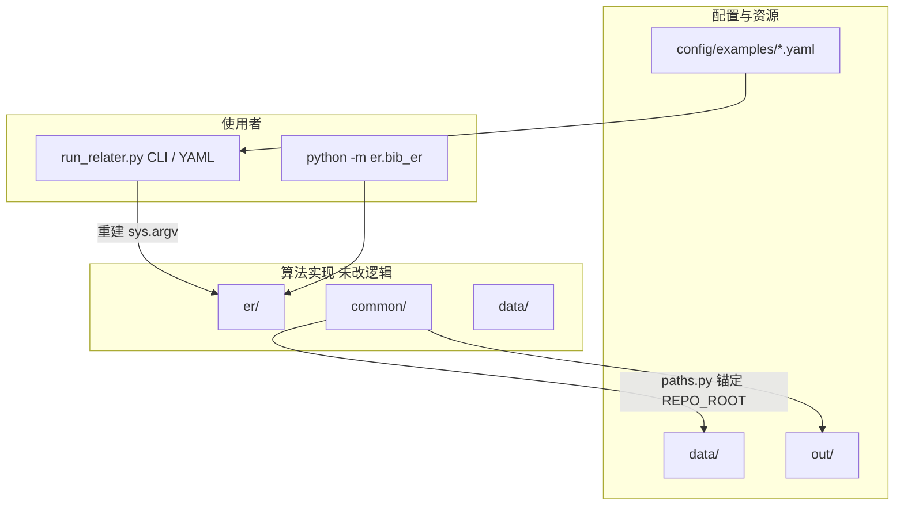

# RELATER 工程结构说明（课程改进版）

## 改进前：隐含假设

- 路径写死为相对目录 `../data`、`../out`，**强依赖**进程启动时的当前工作目录（通常为内层 `RELATER/` 包目录）。
- 超参数通过 **`sys.argv` 位置参数** 传入，`settings` / `hyperparams` 在 **import 时** 就读取 `sys.argv`，命令行不友好，也难以用配置文件做实验记录。
- 顶层目录名为 `RELATER`，内层代码目录也叫 `RELATER/`，新同学容易混淆「仓库根」与「Python 包根」。

## 改进后：分层职责

- **`paths.py`**：用 `__file__` 定位「外层 RELATER 仓库根」，导出 `REPO_ROOT`、`DATA_ROOT`、`OUT_ROOT`。
- **`common/settings.py`**：在保留原有分支逻辑的前提下，将 `data_set_dir` 与 `output_home_directory` 接到 `REPO_ROOT` 下，**任意目录启动** 只要 `sys.path` 正确即可找到数据与输出。
- **`run_relater.py`**：对外是稳定入口；对内仍复用 `er.bib_er`，**不复制**论文算法，降低维护成本。

## 目录一览（仓库根 = 含 `data/`、`out/` 的那一层）

| 路径 | 说明 |
|------|------|
| `RELATER/` | Python 源码包（`common`、`er`、`data`、`febrl`） |
| `RELATER/paths.py` | 路径锚点 |
| `RELATER/run_relater.py` | 启动器 |
| `config/examples/` | 可提交到 Git 的运行配置样例 |
| `docs/` | 架构说明、课程论文、展示提纲 |
| `scripts/` | Shell 包装示例 |

## 刻意未改动的部分

- **实体解析核心**（图构建、`link_gdg`、bootstrap、领域约束等）保持原实现，避免在课程周期内引入算法层面的回归。
- **Python 2.7** 仍为运行上游代码的基准环境；结构改进为后续 **Python 3 迁移** 预留了「路径集中、入口单一」的抓手。
